# SentinelOps: Enterprise DevSecOps Command Center

SentinelOps is a modern, premium DevSecOps Orchestration Platform designed to aggregate and simplify CI/CD pipelines, container monitoring, security vulnerability management, operations telemetry, and cloud infrastructure operations into a single pane of glass.

Built for scale and real-time operations, the platform integrates directly with AWS (EC2, S3, RDS, CloudWatch), GitHub, Jenkins, SonarQube, and Trivy, falling back gracefully to mock simulations when integrations are not configured.

---

## 🚀 Key Highlights & Pitch

* **Unified CI/CD Telemetry:** Track active pipelines across multi-stage lifecycles (Code -> Build -> Test -> Scan -> Docker -> Deploy) with detailed logs and real-time Socket.IO status updates.
* **Vulnerability & Compliance Hub:** Shift-left security scans aggregate Trivy and OWASP findings directly from database tables, calculating a dynamic risk-adjusted security score and compliance status.
* **Live Cloud Infrastructure Monitoring:** Connects to AWS to query active EC2 servers, S3 backup buckets, and RDS instances, mapping live CPU utilization and connections straight from AWS CloudWatch.
* **Container Orchestration Dashboard:** View running Docker containers, stream CPU/Memory limits, and manage starts, stops, or restarts straight from the web console.
* **Task Management (Kanban Board):** Fully interactive Kanban workspace supporting drag-and-drop task progression from Backlog to Review and Completed.
* **PDF Report Generation:** Compile dynamic executive reports using ReportLab PDF generation for deployment histories, compliance posture, and cost charts.
* **Granular Role-Based Access Control:** Protect endpoints using secure JWT auth with custom roles (Admin, DevOps, Security, Viewer), MFA support, and audit log tracking.

---

## 🖼️ Dashboard & Features Showcase

### 1. Welcome & Access
| **Landing & Login** | **Command Center Dashboard** |
| :---: | :---: |
| 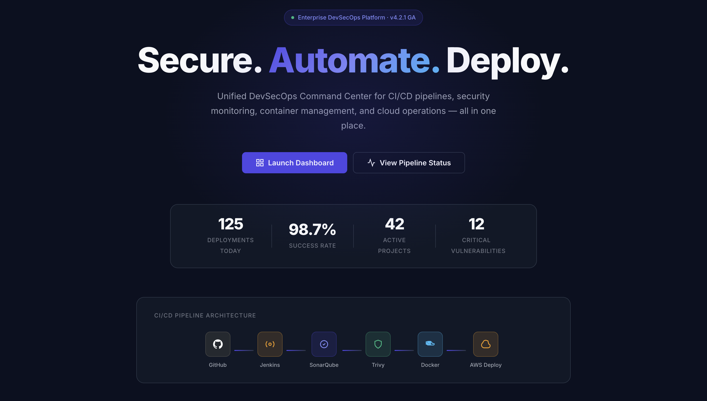 | 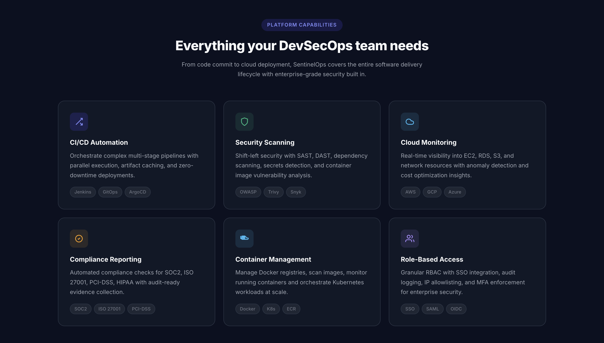 |

### 2. Applications & Delivery
| **Projects Manager** | **CI/CD Pipelines** |
| :---: | :---: |
| 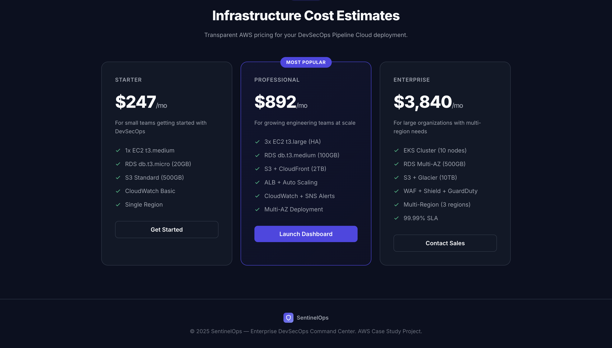 | 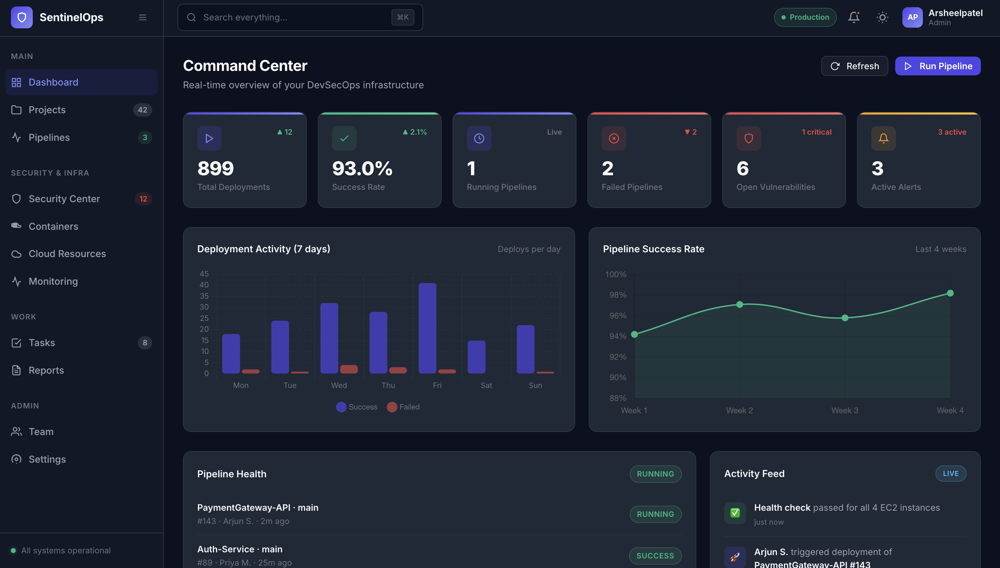 |

### 3. Security & Containers
| **Security Center** | **Containers Monitor** |
| :---: | :---: |
| 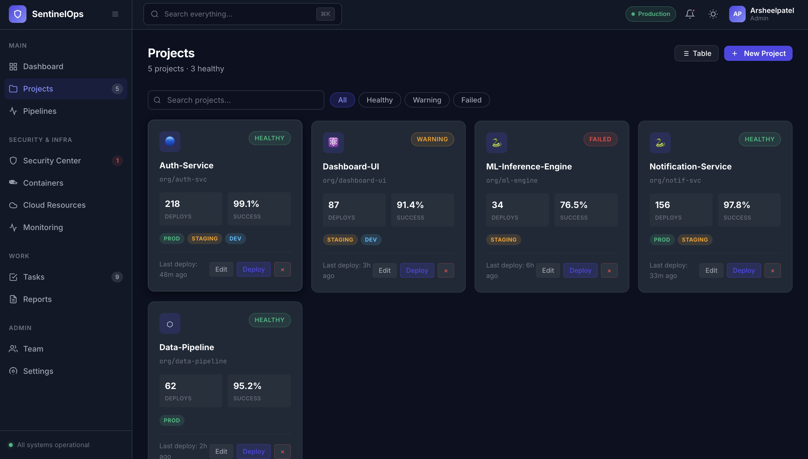 | 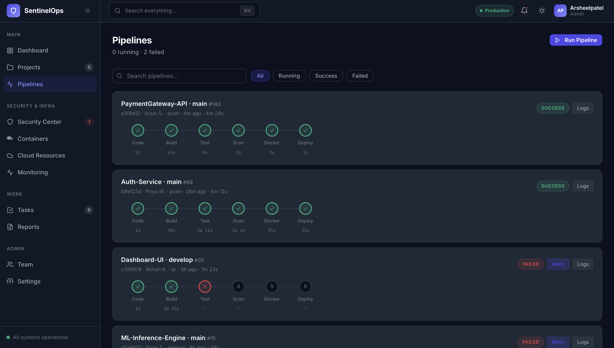 |

### 4. Infrastructure & Telemetry
| **AWS Cloud Resources** | **Operations Monitoring** |
| :---: | :---: |
| 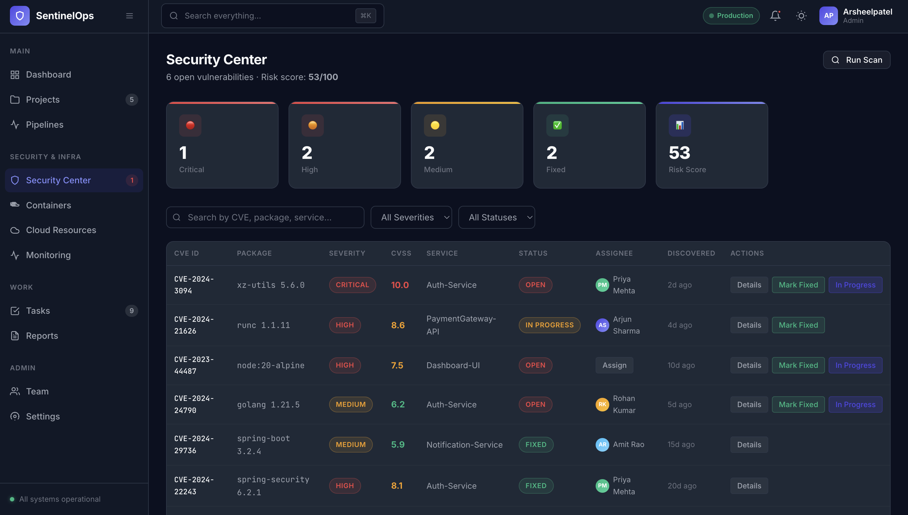 | 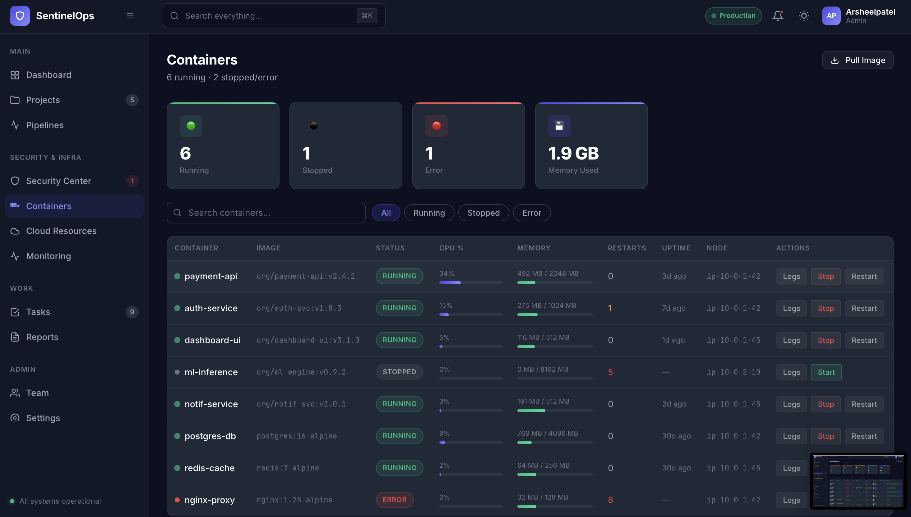 |

### 5. Collaboration & Reporting
| **Kanban Workspace** | **PDF Reporting Center** |
| :---: | :---: |
| 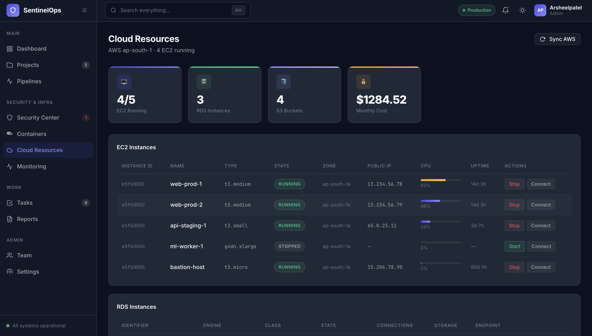 | 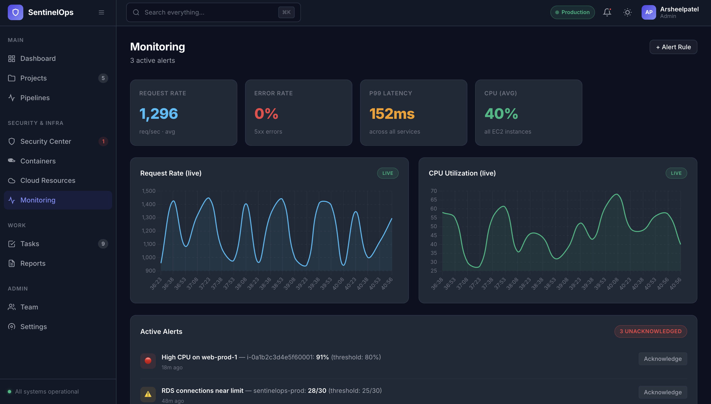 |

### 6. Team & Configurations
| **Team Management** | **App Settings** |
| :---: | :---: |
| 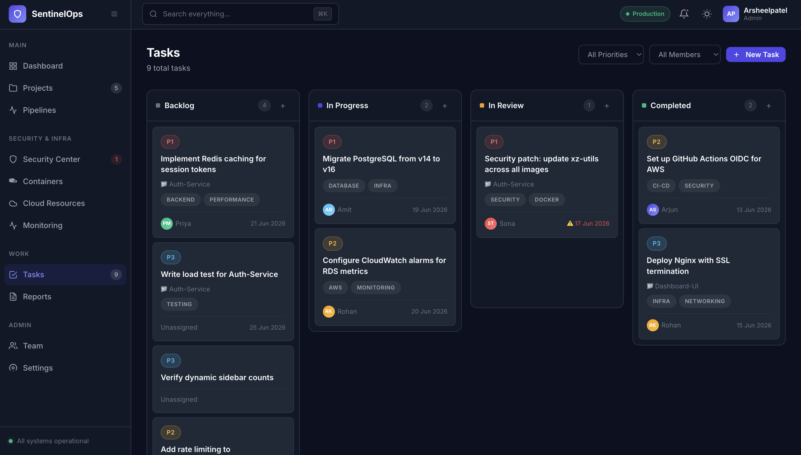 | 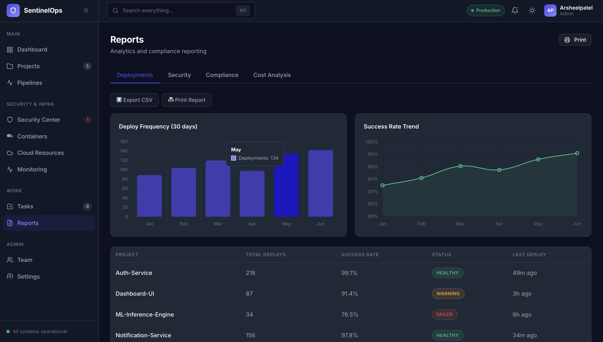 |

### 7. Integrations & Administration
| **SMTP Mail Relay** | **Database Connection Pool** |
| :---: | :---: |
| 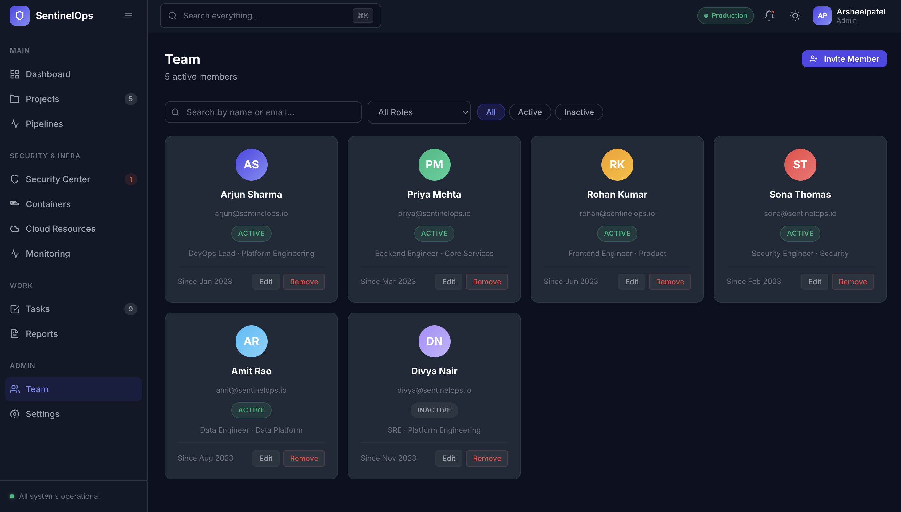 | 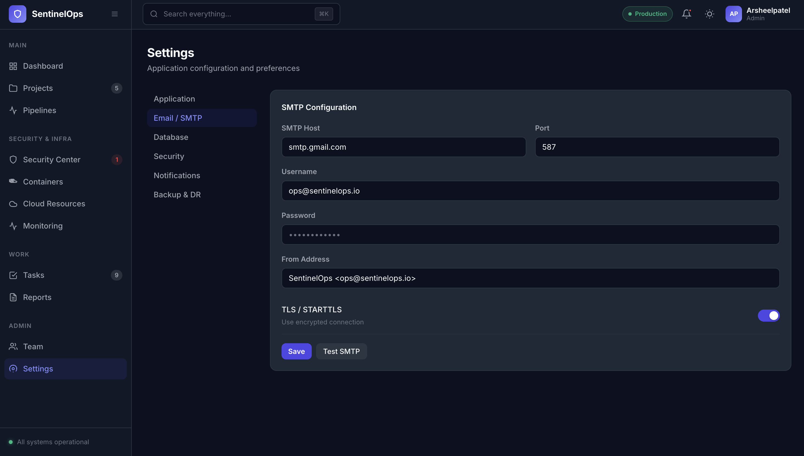 |

### 8. Security Compliance & Disaster Recovery
| **Security Settings** | **Backup & DR Settings** |
| :---: | :---: |
| 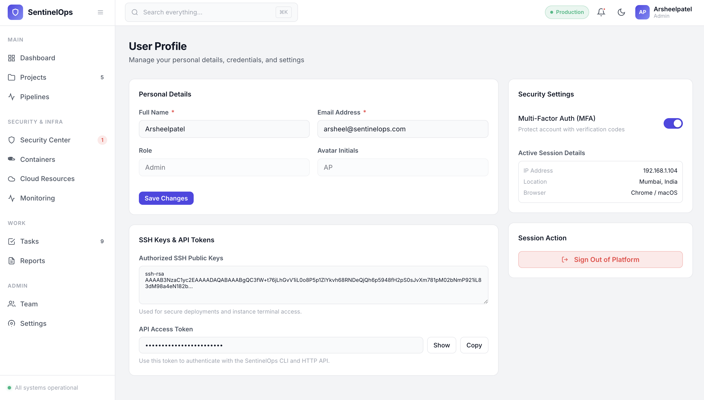 | 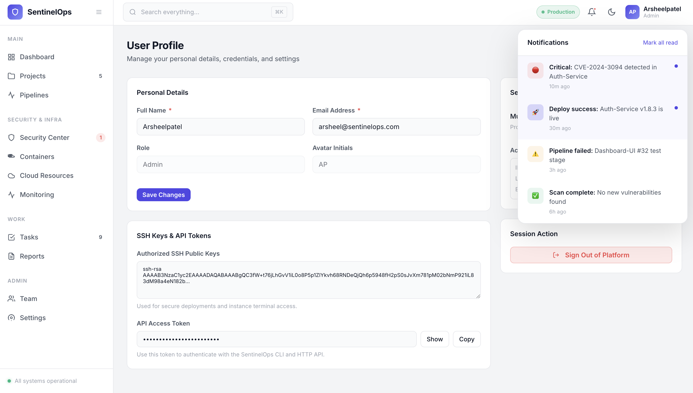 |

---

## 🛠️ Technology Stack

* **Frontend SPA:** Single Page Application built with modern responsive CSS (harmony palettes, glassmorphic filters, transition micro-animations) and vanilla JS logic communicating via AJAX/Socket.IO.
* **Backend API Server:** Python Flask backend running under Gunicorn with Eventlet asynchronous worker threads for high concurrency WebSocket throughput.
* **Database Engine:** MySQL 8 storing persistent state for users, projects, tasks, containers, audit logs, and settings.
* **Reverse Proxy Gateway:** Nginx alpine router proxying static client-side traffic and `/api` REST/Socket.IO calls.
* **Orchestration:** Multi-container Docker Compose setup.

---

## ⚙️ Quick Start Instructions

### Prerequisites
Make sure you have [Docker](https://www.docker.com/) and [Docker Compose](https://docs.docker.com/compose/) installed on your machine.

### 1. Configure Environment Variables
Create a `.env` file in the root directory and configure your credentials:
```env
# Flask Secrets
SECRET_KEY=generate_secure_hex_key
JWT_SECRET_KEY=generate_secure_jwt_key

# Database Settings
DB_HOST=db
DB_PORT=3306
DB_USER=root
DB_PASSWORD=root
DB_NAME=sentinelops_db

# AWS Credentials (Optional, mock fallback operates if blank)
AWS_ACCESS_KEY_ID=your_aws_key_id
AWS_SECRET_ACCESS_KEY=your_aws_secret_key
AWS_DEFAULT_REGION=ap-south-1
```

### 2. Boot the Platform
Build and start the platform services using Docker Compose:
```bash
docker compose up -d --build
```

### 3. Access the Services
* **Frontend Web Dashboard:** Navigate to `http://localhost/` (Nginx port 80).
* **Database Web GUI Console:** Navigate to `http://localhost:8080/` (Adminer database visualizer) to inspect database structures and tables.
* **Credentials:** Log in using username `arjun` and password `Admin123!`.
